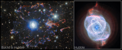

# Preview of potm2602a: "Two observatories, one cosmic eye"
[https://esahubble.org/images/potm2602a/](https://esahubble.org/images/potm2602a/)

For this month’s ESA/Hubble Picture of the Month, we turn our gaze to one of the most visually intricate remnants of a dying star: the Cat’s Eye Nebula, also known as NGC 6543. This extraordinary planetary nebula lies 4 400 light-years away in the constellation Draco, and has captivated astronomers for decades with its elaborate and multilayered structure. Planetary nebulae, so-called because of their round shape when viewed through early telescopes, are in fact expanding gas thrown off by stars in their final stages of evolution. It was the Cat’s Eye Nebula itself where this fact was first discovered in 1864 — examining the spectrum of its light reveals the emission from individual molecules that’s characteristic of a gas, distinguishing planetary nebulae from stars and galaxies.  The NASA/ESA Hubble Space Telescope also revolutionised our understanding of planetary nebulae; its detailed images showed that the simple, circular appearance of a planetary nebula seen from the ground belies a very complex morphology. This was particularly true of the Cat’s Eye Nebula, where Hubble’s images in 1995 revealed never-before-seen structures that broadened our understanding of how planetary nebulae come to be. This time, Hubble is joined by ESA’s Euclid space telescope to create a new image of NGC 6543. The nebula is showcased through the combined eyes of Hubble and Euclid, revealing the remarkable complexity of stellar death in this object. Though primarily designed to map the distant Universe, Euclid captures the Cat’s Eye Nebula as part of its deep imaging surveys. In Euclid’s wide, near-infrared and visible light view, the arcs and filaments of the nebula’s bright central region are situated within a halo of colourful fragments of gas zooming away from the star. This ring was ejected from the star at an earlier stage, before the main nebula at the centre formed. The whole nebula stands out against a backdrop teeming with distant galaxies, demonstrating how local astrophysical beauty and the farthest reaches of the cosmos can be seen together in modern astronomical surveys. Within this broad view of the nebula and its surroundings, Hubble captures the very core of the billowing gas with high-resolution visible-light images, adding extra detail in the centre of this image. The data reveal a tapestry of concentric shells, jets of high-speed gas and dense knots sculpted by shock interactions, features that appear almost surreal in their intricacy. These structures are believed to record episodic mass loss from the dying star at the nebula’s centre, creating a kind of cosmic “fossil record” of its final evolutionary stages. Combining the focused view of Hubble with Euclid’s deep field observations not only highlights the nebula’s exquisite structure, but also places it within the broader context of the Universe that both space telescopes explore. Together, these missions provide a rich and complementary view of NGC 6543 — revealing the delicate interplay between stellar end-of-life processes and the vast cosmic tapestry beyond. [Image Description: Two images of a planetary nebula in space. The image to the left, labelled “Euclid & Hubble”, shows the whole nebula and its surroundings. A star in the very centre is surrounded by white bubbles and loops of gas, all shining with a powerful blue light. Farther away a broken ring of red and blue gas clouds surrounds the nebula. The background shows many stars and distant galaxies. A white box indicates the centre of the nebula and this region is the image to the right, labelled “Hubble”. It shows the multi-layered bubbles, pointed jets and circular shells of gas that make up the nebula, as well as the central star, in greater detail.] Links  Hubble close-up view of the Cat’s Eye Nebula Euclid and Hubble's view of Cat's Eye Nebula Image on ESA website Image on NASA website 

# Histogram

